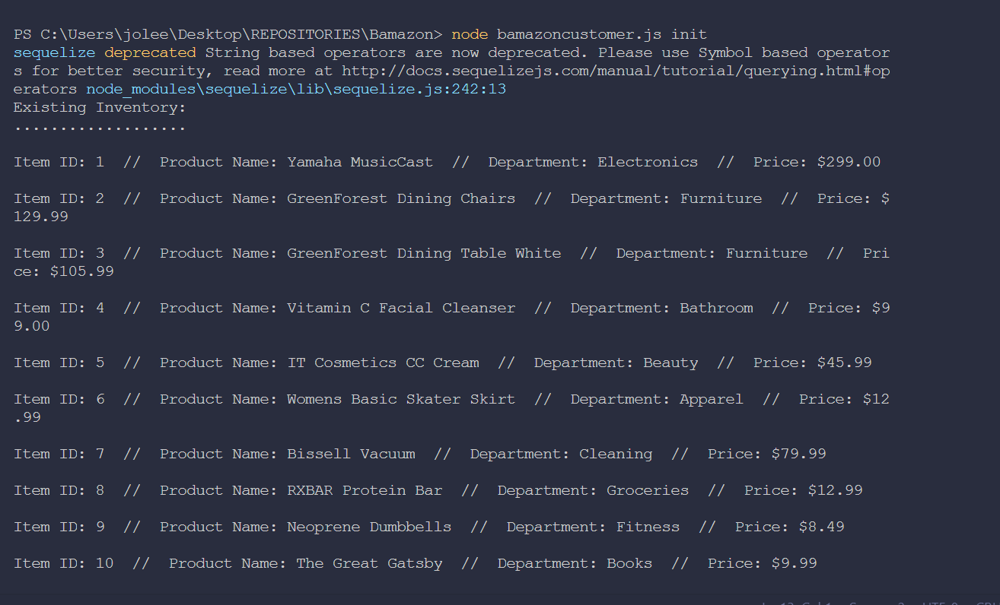
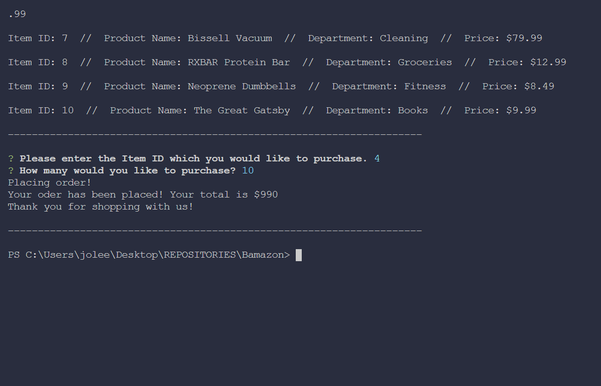
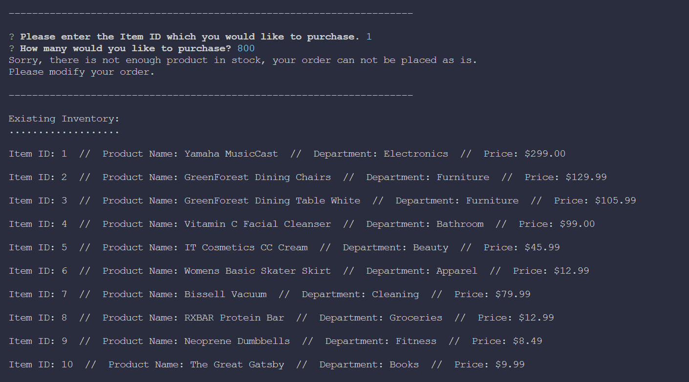

# Bamazon

Bamazon is an app to add and keep track of your product inventory. This version is for the inventory manager to review how much total revenue is left for each product inventory.

Description | Screenshot
 ----------- | ----------
 Enter command *node bamazoncustomer.js init* into terminal | 
 Select item ID and quantity | 
If not enough inventory, select alternative item | 